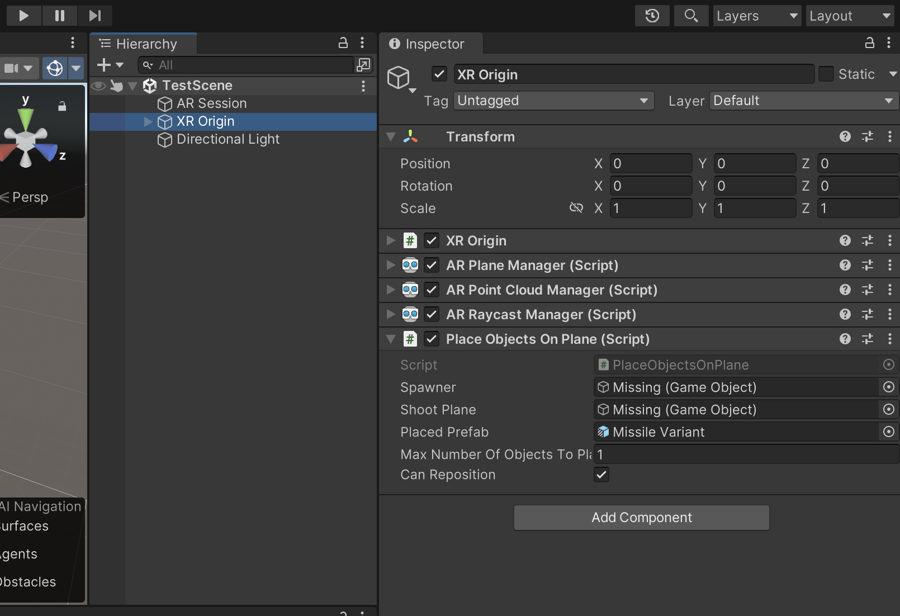
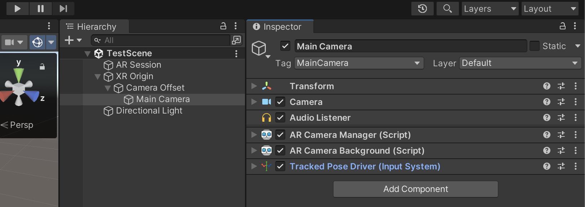

# Unity AR Foundation Core Concepts
## AR Session

Manager of XR session. It enables or disables XR on the target device.

## XR Origin

Manager of objects and tracking features in the scene, it processes, computes and updates objects’ position, orientation, and scale.

## Camera

Camera: Player’s viewport in an XR scene.

