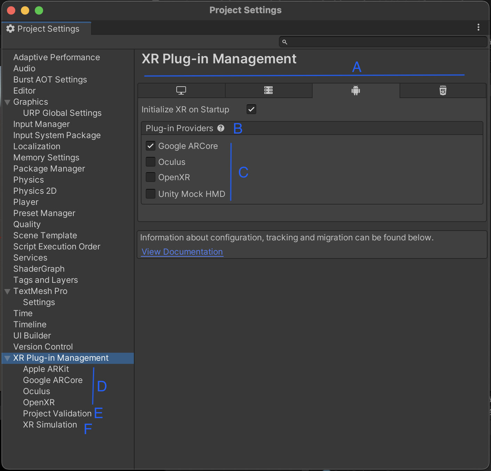

# Unity XR Plug-in Management
Unity's XR Plugin Management is a system that allows developers to enable and configure the plug-ins needed for the XR devices and platforms using the Unity Editor.

You can enable and configure XR Plug-in Management

*   Edit | Projet Settings | XR Plug-in Management

| Label | Setting                       | Purpose                                                                                                                                                                                                                                                                                                                                                                                                                                                                                                                                                         |
| ----- | ----------------------------- | --------------------------------------------------------------------------------------------------------------------------------------------------------------------------------------------------------------------------------------------------------------------------------------------------------------------------------------------------------------------------------------------------------------------------------------------------------------------------------------------------------------------------------------------------------------- |
| A     | **Build target tabs**         | A tab is shown for each platform build target installed for the current Unity Editor. You can add additional platform support modules with the Unity Hub.                                                                                                                                                                                                                                                                                                                                                                                                       |
| B     | **Initialize XR on Startup**  | Whether the game or application should start in XR mode immediately. If disabled, then your application logic is responsible for initializing XR at the appropriate time. For example, your app could start with a normal desktop display and then switch to XR on demand. See [:u[Automatic XR loading]]\([https://docs.unity3d.com/Packages/com.unity.xr.management@4.3/manual/EndUser.html#automatic-xr-loading) for](https://docs.unity3d.com/Packages/com.unity.xr.management@4.3/manual/EndUser.html#automatic-xr-loading\)%C2%A0for) more information. |
| C     | **Plug-in Providers**         | The list of known XR provider plug-ins. This list contains the plug-ins officially supported by Unity or its strategic partners as well as any third-party provider plug-ins you have installed with the Package Manager. When you enable a provider plug-in, Unity adds the associated package to the project if it is not already installed. Disabling a plug-in does not remove the package. (You can remove packages with the Package Manager.)                                                                                                             |
| D     | **Provider plug-in settings** | The settings for each installed XR provider plug-in appear in their own pages within the **XR Plug-in Management** section. For information about the available settings for a specific plug-in refer to that plug-in’s documentation. You can find a list of plug-ins and links to their documentation in [:u[Provider plug-ins]]\(<https://docs.unity3d.com/Manual/xr-support-packages.html#plug-ins>).                                                                                                                                                     |
| E     | **Project Validation**        | Displays the results of project validation checks for the plug-ins you have enabled. To view the checks, select the **Project Validation** page inside the **XR Plug-in Management** section of your **Project Settings**** **.                                                                                                                                                                                                                                                                                                                             |
| F     | **XR Simulation settings**    | The **AR**  Foundation package provides an **XR Simulation** feature, which lets you test AR **Scenes**  in the Unity Editor. See [:u[XR Simulation project settings]]\([https://docs.unity3d.com/Packages/com.unity.xr.arfoundation@5.0/manual/xr-simulation/simulation-project-settings.html) for](https://docs.unity3d.com/Packages/com.unity.xr.arfoundation@5.0/manual/xr-simulation/simulation-project-settings.html\)%C2%A0for) a description of these settings and options.                                                                           |

> — source: <https://docs.unity3d.com/Manual/xr-plugin-management.html>