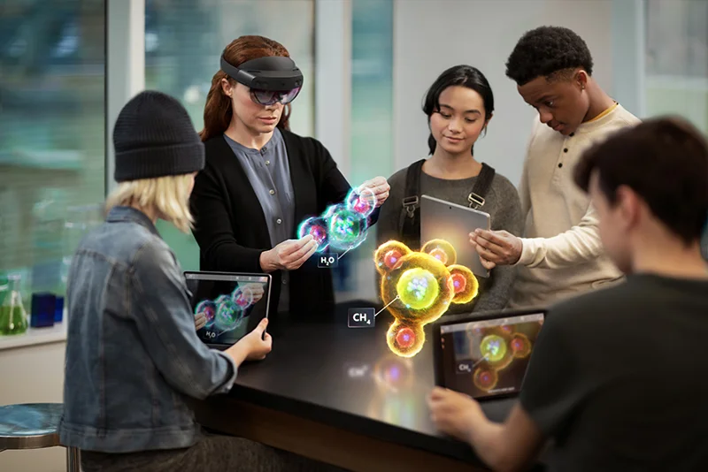

# XR Unity - Course Introduction

— source: <https://laval-virtual.com/>

XR or Extended Reality, is an emerging technology to create immersive applications and experiences that blend digital and real-worlds. It spans Augmented Reality (AR), Virtual Reality (VR), and Mixed Reality (MR), which we will learn more about in this course.

We designed this course around labs and projects to help you understand and practice the main concepts. We will be using **Unity**.

We will explore the spectrum of 3D and XR, including AR, VR, and MR. Along the way, we will tackle the most important concepts of Unity, such as scene, camera, rendering, gameObject, c# programming, scripting, effects, and many more.

## What is Unity?

Unity is a real-time graphics authoring tool by Unity Technologies. It is an IDE for real-time graphics. Developers can use Unity to create different types of applications, including 2D, 3D, and XR. Unity has interesting features:

- Cross-platform: Using Unity, developers can use more or less the same tools to create and package applications for different devices, Android devices, iOS, headsets, windows, and even the web using WebGL.
- Structured editor programming: Using Unity developers can program a wide range of aspects of their applications using simple structured editing, drag-and-drop, drop-down menus, and configuration templates.
- Visual programming: Unity offers possibilities for developers and graphics creators to create and manipulate, 3D objects, behaviors, and interactions using a visual interface, very much like “Scratch.”
- Scripting: In addition to structured editor, and visual programming, Unity offers a programming approach called scripting, using C# (.NET C-Sharp, but also other languages) to create more advanced features.

## Why Unity?

XR relies on a wide range of computer graphics technologies, including 3D rendering, physics simulations, camera processing, computer vision, such as object and body tracking, and many more. Such technologies can be hard to work with and master. Luckily, **Unity** has many built-in tools that make the process of creating XR applications easier for developers.
