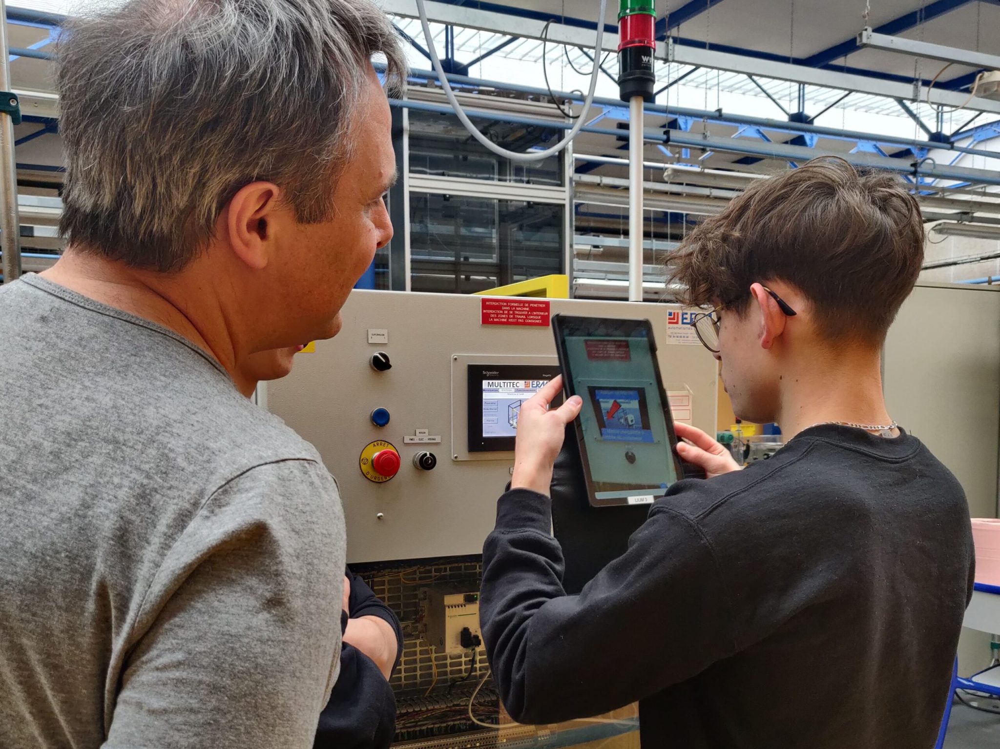
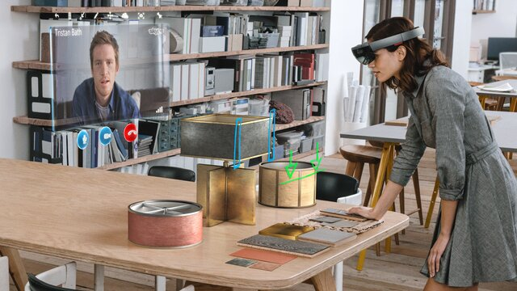
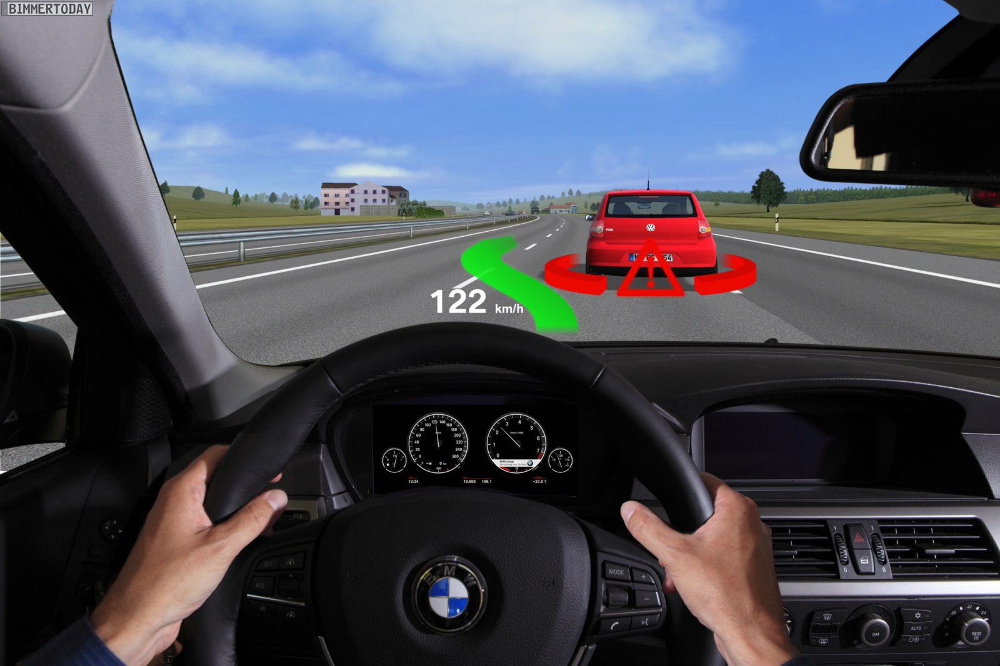

# What is AR?

AR technology overlays digital content (texts, graphics, images, videos, audio, 3D objects, etc.) over the user's view of the real environment to see the digital content as part of the real environment. The more the digital content blends with the real world the more engaging the AR content can be.

AR technology is promising in the XR spectrum because of its simplicity. It does not require headsets or goggles.

## Hand-held AR

— Source: <https://mixap-lium.univ-lemans.fr/>

Modern smartphones, tablets, and PCs are equipped with capabilities to handle AR experiences and applications. Millions of users worldwide have one or more of these types of devices. That’s why some of the famous AR applications use hand-held devices.

- Pokemon-go
- Ikea Place
- Snapchat

## Head-worn AR

— Source: Helene Xue User Satisfaction in Augmented Reality-Based Training Using Microsoft HoloLens

This type of AR projects digital content into a headset while enabling users to see-through (pass-through).

It is suitable for immersive experiences or where the user needs to perform tasks with their hands. For example, Meta Quest 2 or 3 and Hololens are examples of head-worn AR devices.

## Head-up AR

— Source: bing.com

Head-up AR project digital content into the windshield. For example, in automotive or fighter jets the driver or pilot will have information displayed in their view.
