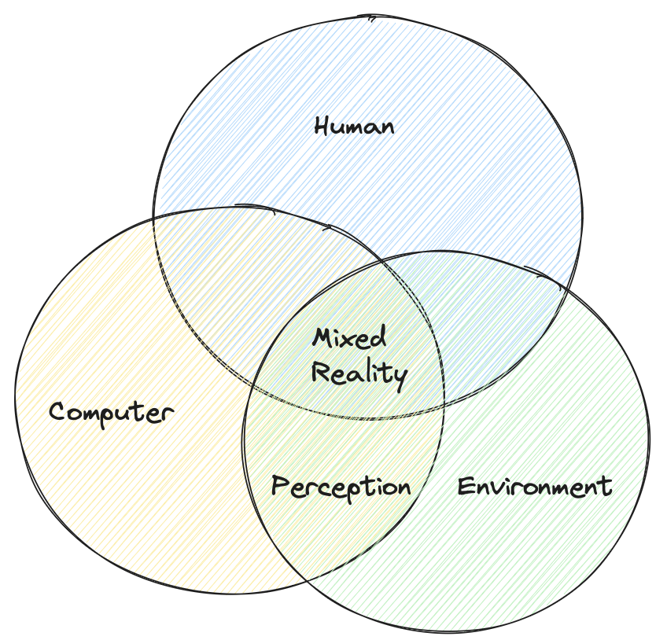

# XR Interaction

XR is characterized as human-computer-environment interaction.

- Human understanding: capturing human interactions and input, including, position, hand-tracking, eye-tracking, and speech

<!---->

- Environment understanding: mapping and anchoring of spaces, surfaces, locations, and objects
- Computer processing: sensing, rendering, and keeping track of both human and environment

:::excalidraw
[{"type":"ellipse","version":236,"versionNonce":1411061008,"isDeleted":false,"id":"s36Jl0OBjU70JQhmCcoF8","fillStyle":"hachure","strokeWidth":1,"strokeStyle":"solid","roughness":1,"opacity":100,"angle":0,"x":99.31707317073165,"y":139.39481707317083,"strokeColor":"#1e1e1e","backgroundColor":"#a5d8ff","width":306,"height":287,"seed":809278448,"groupIds":[],"frameId":null,"roundness":{"type":2},"boundElements":[],"updated":1701522385969,"link":null,"locked":false},{"type":"ellipse","version":258,"versionNonce":352653584,"isDeleted":false,"id":"1aveR4TysFJwWIS64Lr81","fillStyle":"hachure","strokeWidth":1,"strokeStyle":"solid","roughness":1,"opacity":100,"angle":0,"x":-0.09756097560972421,"y":274.49237804878044,"strokeColor":"#1e1e1e","backgroundColor":"#ffec99","width":307,"height":278,"seed":1913403376,"groupIds":[],"frameId":null,"roundness":{"type":2},"boundElements":[],"updated":1701522389151,"link":null,"locked":false},{"type":"ellipse","version":332,"versionNonce":1847728400,"isDeleted":false,"id":"Rj7iWIXY42DpoeGPJwq56","fillStyle":"hachure","strokeWidth":1,"strokeStyle":"solid","roughness":1,"opacity":100,"angle":0,"x":162.73170731707307,"y":307.76067073170725,"strokeColor":"#1e1e1e","backgroundColor":"#b2f2bb","width":289,"height":272,"seed":1977615856,"groupIds":[],"frameId":null,"roundness":{"type":2},"boundElements":[],"updated":1701522381923,"link":null,"locked":false},{"type":"text","version":236,"versionNonce":1412154864,"isDeleted":true,"id":"UaeIfErrWel5DnRWh0ulp","fillStyle":"hachure","strokeWidth":1,"strokeStyle":"solid","roughness":1,"opacity":100,"angle":0,"x":331.3230701185439,"y":414.02097775862956,"strokeColor":"#1e1e1e","backgroundColor":"transparent","width":10,"height":25,"seed":1943854864,"groupIds":[],"frameId":null,"roundness":null,"boundElements":[],"updated":1701522286993,"link":null,"locked":false,"fontSize":20,"fontFamily":1,"text":"","textAlign":"center","verticalAlign":"middle","containerId":"Rj7iWIXY42DpoeGPJwq56","originalText":"","lineHeight":1.25,"baseline":19},{"type":"text","version":2,"versionNonce":232682256,"isDeleted":true,"id":"AYmoD767R6ntkvHs_pau9","fillStyle":"hachure","strokeWidth":1,"strokeStyle":"solid","roughness":1,"opacity":100,"angle":0,"x":150,"y":240.6875,"strokeColor":"#1e1e1e","backgroundColor":"transparent","width":10,"height":25,"seed":1485109008,"groupIds":[],"frameId":null,"roundness":null,"boundElements":[],"updated":1701522216515,"link":null,"locked":false,"fontSize":20,"fontFamily":1,"text":"","textAlign":"left","verticalAlign":"top","containerId":null,"originalText":"","lineHeight":1.25,"baseline":19},{"type":"text","version":63,"versionNonce":628768752,"isDeleted":false,"id":"sO57CSf7vjsLMonhPXWP9","fillStyle":"hachure","strokeWidth":1,"strokeStyle":"solid","roughness":1,"opacity":100,"angle":0,"x":212.95121951219505,"y":205.0777439024392,"strokeColor":"#1e1e1e","backgroundColor":"transparent","width":57.720001220703125,"height":25,"seed":537456400,"groupIds":[],"frameId":null,"roundness":null,"boundElements":[],"updated":1701522312614,"link":null,"locked":false,"fontSize":20,"fontFamily":1,"text":"Human","textAlign":"left","verticalAlign":"top","containerId":null,"originalText":"Human","lineHeight":1.25,"baseline":19},{"type":"text","version":2,"versionNonce":16689936,"isDeleted":true,"id":"OsPLUzEcSKxy4Jd8pA-4R","fillStyle":"hachure","strokeWidth":1,"strokeStyle":"solid","roughness":1,"opacity":100,"angle":0,"x":441,"y":257.6875,"strokeColor":"#1e1e1e","backgroundColor":"transparent","width":10,"height":25,"seed":265498384,"groupIds":[],"frameId":null,"roundness":null,"boundElements":[],"updated":1701522288040,"link":null,"locked":false,"fontSize":20,"fontFamily":1,"text":"","textAlign":"left","verticalAlign":"top","containerId":null,"originalText":"","lineHeight":1.25,"baseline":19},{"type":"text","version":58,"versionNonce":1660701456,"isDeleted":false,"id":"n9Nkf-MWcZNXjL2JRleLY","fillStyle":"hachure","strokeWidth":1,"strokeStyle":"solid","roughness":1,"opacity":100,"angle":0,"x":316.1219512195122,"y":463.0289634146342,"strokeColor":"#1e1e1e","backgroundColor":"transparent","width":110.92001342773438,"height":25,"seed":945950704,"groupIds":[],"frameId":null,"roundness":null,"boundElements":[],"updated":1701522371980,"link":null,"locked":false,"fontSize":20,"fontFamily":1,"text":"Environment","textAlign":"left","verticalAlign":"top","containerId":null,"originalText":"Environment","lineHeight":1.25,"baseline":19},{"type":"text","version":2,"versionNonce":2088955664,"isDeleted":true,"id":"p1an_5DT4eI4wwsNKRWcI","fillStyle":"hachure","strokeWidth":1,"strokeStyle":"solid","roughness":1,"opacity":100,"angle":0,"x":-19,"y":250.6875,"strokeColor":"#1e1e1e","backgroundColor":"transparent","width":10,"height":25,"seed":224921072,"groupIds":[],"frameId":null,"roundness":null,"boundElements":[],"updated":1701522294414,"link":null,"locked":false,"fontSize":20,"fontFamily":1,"text":"","textAlign":"left","verticalAlign":"top","containerId":null,"originalText":"","lineHeight":1.25,"baseline":19},{"type":"text","version":67,"versionNonce":8885744,"isDeleted":false,"id":"8XvBXNyuxRHDPgCvJKByN","fillStyle":"hachure","strokeWidth":1,"strokeStyle":"solid","roughness":1,"opacity":100,"angle":0,"x":24,"y":409.6875,"strokeColor":"#1e1e1e","backgroundColor":"transparent","width":88.68000030517578,"height":25,"seed":1421765392,"groupIds":[],"frameId":null,"roundness":null,"boundElements":[],"updated":1701522302790,"link":null,"locked":false,"fontSize":20,"fontFamily":1,"text":"Computer","textAlign":"left","verticalAlign":"top","containerId":null,"originalText":"Computer","lineHeight":1.25,"baseline":19},{"type":"text","version":53,"versionNonce":995761424,"isDeleted":false,"id":"RyFBs6nDZz1-KvQ7bPgr1","fillStyle":"hachure","strokeWidth":1,"strokeStyle":"solid","roughness":1,"opacity":100,"angle":0,"x":211.39024390243924,"y":356.66310975609764,"strokeColor":"#1e1e1e","backgroundColor":"transparent","width":68.15999603271484,"height":50,"seed":1750664688,"groupIds":[],"frameId":null,"roundness":null,"boundElements":[],"updated":1701522375613,"link":null,"locked":false,"fontSize":20,"fontFamily":1,"text":"Mixed \nReality","textAlign":"left","verticalAlign":"top","containerId":null,"originalText":"Mixed \nReality","lineHeight":1.25,"baseline":44},{"type":"text","version":2,"versionNonce":1889953040,"isDeleted":true,"id":"1WH5P-OczHBsv9PTULCV0","fillStyle":"hachure","strokeWidth":1,"strokeStyle":"solid","roughness":1,"opacity":100,"angle":0,"x":716.2682926829277,"y":490.8094512195125,"strokeColor":"#1e1e1e","backgroundColor":"transparent","width":10,"height":25,"seed":776038672,"groupIds":[],"frameId":null,"roundness":null,"boundElements":[],"updated":1701522355451,"link":null,"locked":false,"fontSize":20,"fontFamily":1,"text":"","textAlign":"left","verticalAlign":"top","containerId":null,"originalText":"","lineHeight":1.25,"baseline":19},{"type":"text","version":92,"versionNonce":1333033232,"isDeleted":false,"id":"AKhImo7ynkFjGNdl3tgSn","fillStyle":"hachure","strokeWidth":1,"strokeStyle":"solid","roughness":1,"opacity":100,"angle":0,"x":182.63414634146358,"y":462.6631097560978,"strokeColor":"#1e1e1e","backgroundColor":"transparent","width":99.69999694824219,"height":25,"seed":1973302768,"groupIds":[],"frameId":null,"roundness":null,"boundElements":[],"updated":1701545069599,"link":null,"locked":false,"fontSize":20,"fontFamily":1,"text":"Perception","textAlign":"left","verticalAlign":"top","containerId":null,"originalText":"Perception","lineHeight":1.25,"baseline":19}]
:::
