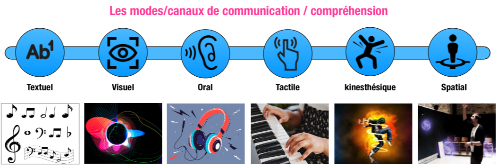

# XR is Multimodal

XR is multimodal because it blends visual, haptic, and auditory interactions that are realistic, as far as possible.

## Multimodality

Simply put, multimodality is the technique of using multiple “modes” of presenting and communicating information to audiences. For example, instead of using only text (one mode), a multimodal interface would include a combination of text, emojis, images, video, audio, motion, animation, interactivity, or 3D objects, etc.

## Benifit of Multimodality

- Promotes more interactivity

<!---->

- Presenting information in multiple ways

<!---->

- Adapts information to befit different audiences
- Supports better comprehension because more senses and cognitive processes are engaged
