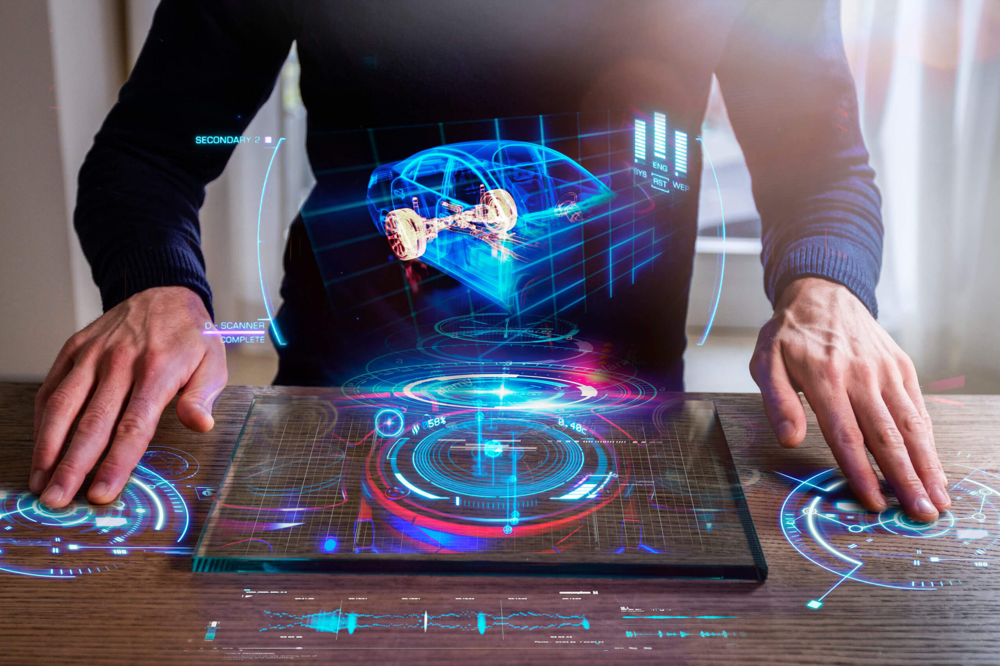

# XR is Spatial

— Source: <https://fishermenlabs.com/blog/how-spatial-computing-will-transform-our-world/>

XR is also spatial because most interactions are anchored in physical and virtual spaces and environments.

Spatial computing is a new way of engaging and interacting with the real world. It enables us to see the real world, augment it, and interact with it in new ways.
