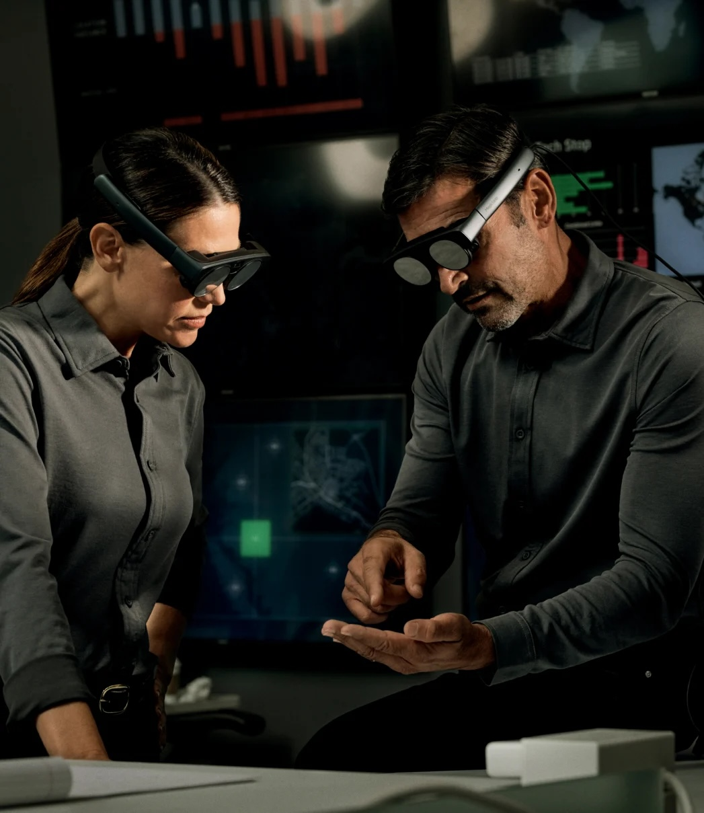

# XR Devices

**Objectives**

- Understand and identify devices by type
- Understand and explain the characteristics of each type of XR devices
- Summarize the differences between tethered vs. untethered devices

## Head-worn

Also called Head-Mounted Displays (HMDs), are designed to be worn on your head like a pair of glasses or goggles. They provide an immersive experience by blocking out the outside world and displaying digital content directly in front of your eyes. Examples of HMDs include Oculus Rift, HTC Vive, Meta Quest, and PlayStation VR.

## Hand-held

— source: [oreilly.com](http://oreilly.com)

Are held in hand and use a screen that is positioned in field of view of the user. Smartphone or tablet, are great examples of hand-held devices. Modern hand-held devices are equiped with capabilities, sensors, and cameras to enable 3D rendering, real-time tracking, GPS, depth, etc.

## Smart-glasses

— source : [magicleap.com](http://magicleap.com)

Smart glasses are wearable devices that display information overlaid onto the real world. They typically have a see-through (or pass-through) display and may also include features such as voice assistants, fitness tracking, and augmented reality capabilities. Examples of smart glasses include Google Glass (discontinued), Ray-Ban Meta Smart Glasses, Ray-Ban Stories, Magicleap 2, etc.

## Tethered and untethered devices

Tethered devices require a connection to a computer or other device to function, while untethered devices do not. Tethered devices often offer higher performance and more advanced features, but they can be limited by the constraints of their connection. Untethered devices, on the other hand, offer greater mobility and convenience, but may sacrifice some performance and features compared to tethered devices.

For example, a tethered VR headset like the first Apple Vision Pro requires a powerful computer to run and provides high-quality graphics and motion tracking. On the other hand, an untethered VR headset like the Meta Quest 2 offers a simpler and more affordable option.

## Choosing a type of reality

XR experiences are created differently. Here is a small list of recommendations to keep in mind when choosing a type of reality.

### Level of immersion AR/VR/MR:

- Fully immersive with no real word, require a headset
- A mix of both real and virtual worlds MR (AR/VR)

### Indoors/outdoor experiences

- Location can be restricted, especially indoors (GPS)
- Tethered devices are not suitable for outdoors
- The intensity of the sun can impact experiences
- Same for the dark environment can impact experiences

### Graphics rendering

- Might require powerful resources of devices (e.g., hand-held)
