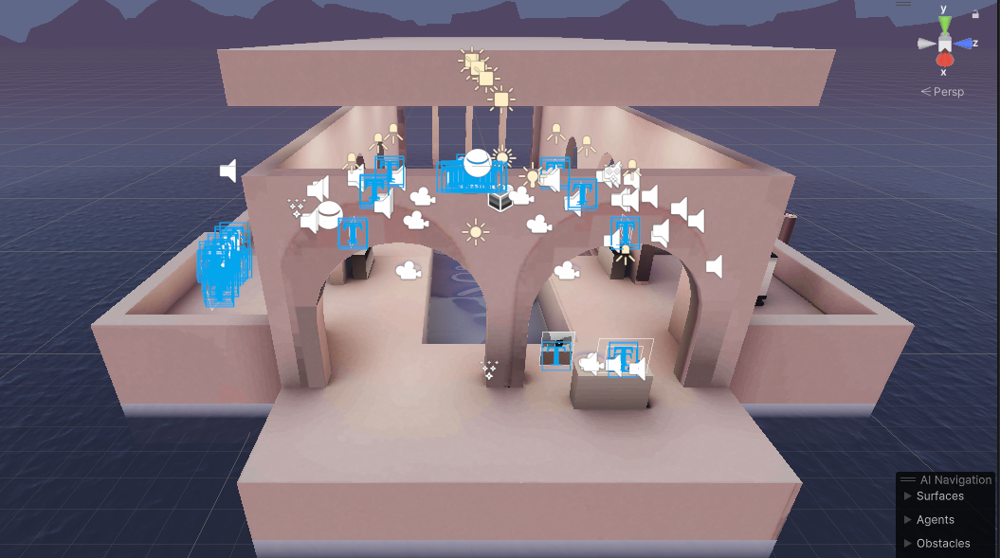

# XR Environment

— source: Unity XR Interaction Toolkit

XR environment refers AR or VR environment in which the XR application takes place. In Unity often the environment includes environmental features, such as terrains, landforms, vegetation, sky, and light.

The XR environment is important for providing immersive experiences, where users can interact with digital and real objects, and get real-time feedback (haptic, auditory, visual).
