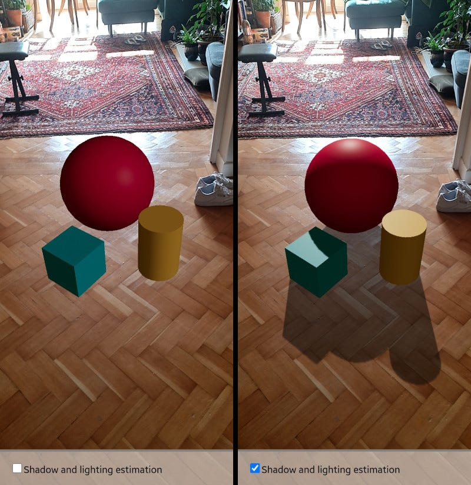

# XR Light Estimation

— source: <https://medium.com/samsung-internet-dev/integrating-augmented-reality-objects-into-the-real-world-with-light-and-shadows-12123e7b1151>

In XR (AR/MR) the user environment has already a real light. Light estimation is a technique for capturing, replicating, and integrating the user environment's light in XR.

As the user moves through their environment, their device will take pictures and build an internal representation of the lighting, which is then injected into Unity's lighting system for use with materials and shaders.
