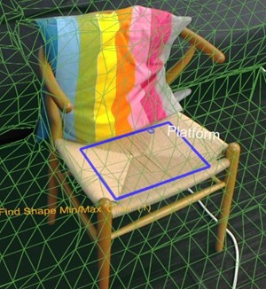

# XR Scene Understanding

— source: [learn.microsoft.com/en-us/windows/mixed-realit](http://learn.microsoft.com/en-us/windows/mixed-realit)

XR scene understanding combines spatial mapping and computer vision techniques to process and understand details in the environment. The user’s devices (e.g., XR) receive raw data from the sensors (e.g., camera). The received information is unstructured. For example, the devices can receive portions of the walls of over a period of time, which might not be understood as walls. With scene understanding, we can process raw information and create more higher-level representations, such as walls, floor, ceilling, etc. This enables users to interact intelligently with the real world objects.
