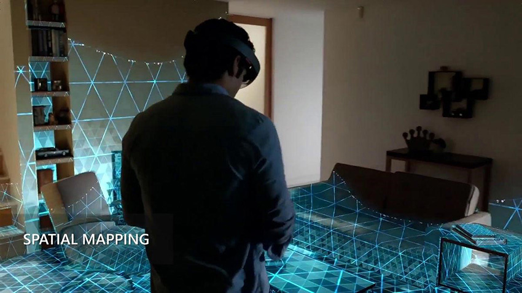

# XR Spatial Mapping

— source: <https://docs.unity3d.com/2019.2/Documentation/Manual/SpatialMapping.html>

Spatial mapping involves using sensors, cameras, or other technologies to capture the geometry, structures, surfaces, furniture, doors, features, and layout of a physical space. XR applications that require spatial mapping apply room scanning to collect to create a digital representation of the environment.
