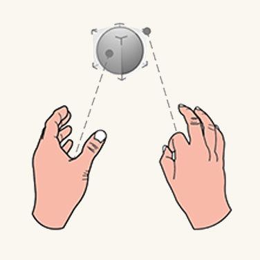

# XR Direct Manipulation

— source: [learn.microsoft.com/en-us/windows/mixed-reality](https://learn.microsoft.com/en-us/windows/mixed-reality)

Direct manipulation is an input model where users use their hands to interact with objects in an XR scene. This is referred to as “near” interaction. This model mimics real-world interactions. For example, a user can poke a button to click it, grab and rotate an object in 3D space, or point and scroll a view.
