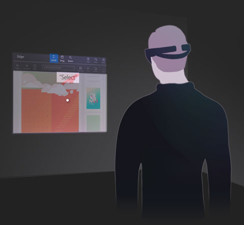

# XR Gaze-based Interaction

— source: [learn.microsoft.com/en-us/windows/mixed-reality](https://learn.microsoft.com/en-us/windows/mixed-reality)

This model is also part of :ref[XR Hand-free model]{path='/notes'}. This includes eye-gaze and head-gaze interaction.

Eye-gaze enables the use of a user's eyes as an input method for interacting with objects in XR. It can rely on eye movement (saccades, smooth, and fixations) and/or gaze direction (direction of where a person is looking).

**Gaze and commit** is a type of interaction where

- a user looks at an object (targeting), then
- perform a secondary input, such as using hand or voice

**Gaze and dwell** is a type of interaction where

- a user looks at an object (targeting), then
- keep looking at the target to select

Head-gaze and commit is a special type of interaction where a

- use target an object with their head
- perform a secondary input, such as using hand or voice
