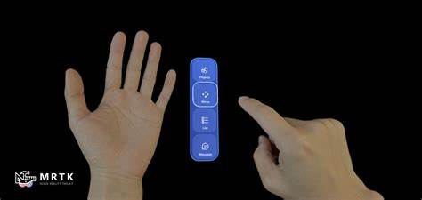

# XR Hand Menu

— source: [learn.microsoft.com/en-us/windows/mixed-reality](https://learn.microsoft.com/en-us/windows/mixed-reality)

A technique that allows the user to quickly bring up hand-attached UI. It is accessible anytime. It can be shown and hidden easily and is great for quick actions.
