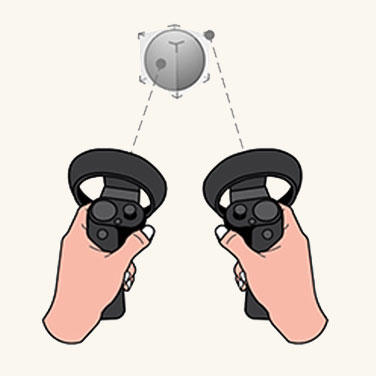

# XR Motion Controllers Interaction Model

— source: [learn.microsoft.com/en-us/windows/mixed-reality](https://learn.microsoft.com/en-us/windows/mixed-reality)

Motion controllers are hardware accessories that allow users to take actions in a 3D XR space. This includes:

- Manipulating objects
- Locomotion
- Teleportation
