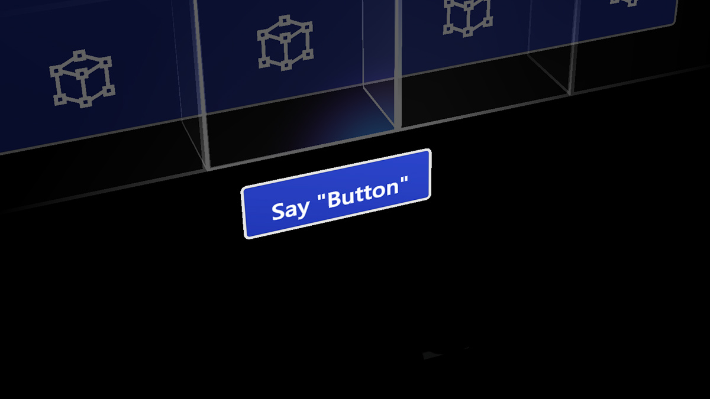

# XR Voice Interaction

— source: [learn.microsoft.com/en-us/windows/mixed-reality](https://learn.microsoft.com/en-us/windows/mixed-reality)

This model is part of the :ref[XR Hand-free model]{path='/notes'}. This can be seen as a "_see it, say it_" interaction where the user can interact with objects and elements of the scene by talking out loud. Similar to :ref[XR Point and Commit]{path='/notes'}, the head or the Gaze (see :ref[XR Gaze-based Interaction]{path='/notes'}) is the means to target objects. Some interactions might not require targeting.

Voice interaction might not be practical in louder conditions.
