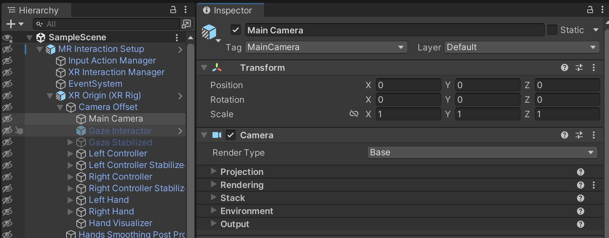

# Unity Camera

A component that creates an image of a particular viewpoint in your scene.

It is the player's view of a scene (player's eyes). Unity supports both perspective (realistic) and orthographic (fixed size) cameras.

Unity has a camera component that handles the logic of the camera. The camera component offers various options. In a project, usually, we will have (or create a new) GameObject and attach to it the camera component.

— Unity camera component
