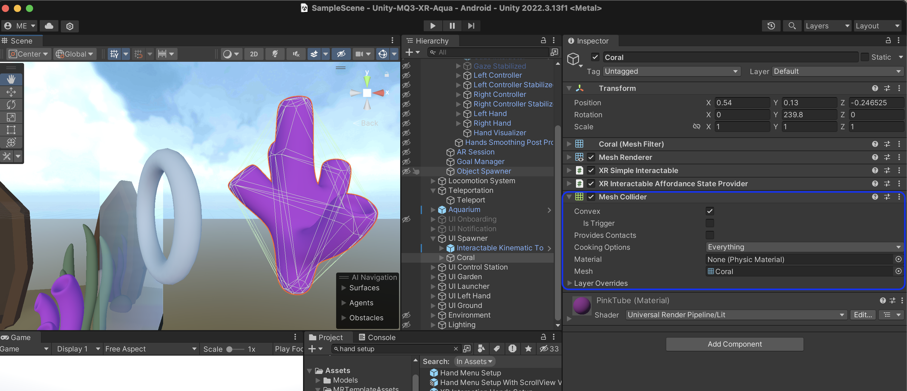

# Unity Colliders

Colliders are types of components in Unity. They are an essential part of the physics simulation of GameObjects. Colliders detect collisions between GameObjects. In Unity, colliders offer APIs to respond to collisions between GameObjects, when they are detected.

There are several types of colliders in Unity, with different behaviors.

The most common types of colliders are:

**Box Collider**: A 3D rectangular shape that surrounds an object. It's commonly used objects, such as walls, floors, and ceilings.

**Sphere Collider**: A sphere that surrounds an object. It's commonly used for objects, such as balls, characters, and projectiles.

**Capsule Collider**: A cylindrical shape with hemispherical ends. It's commonly used for character controllers, such as player avatars or NPCs.

We can add colliders to objects as components. Below is an example of a mesh collider.

— Mesh Collider
