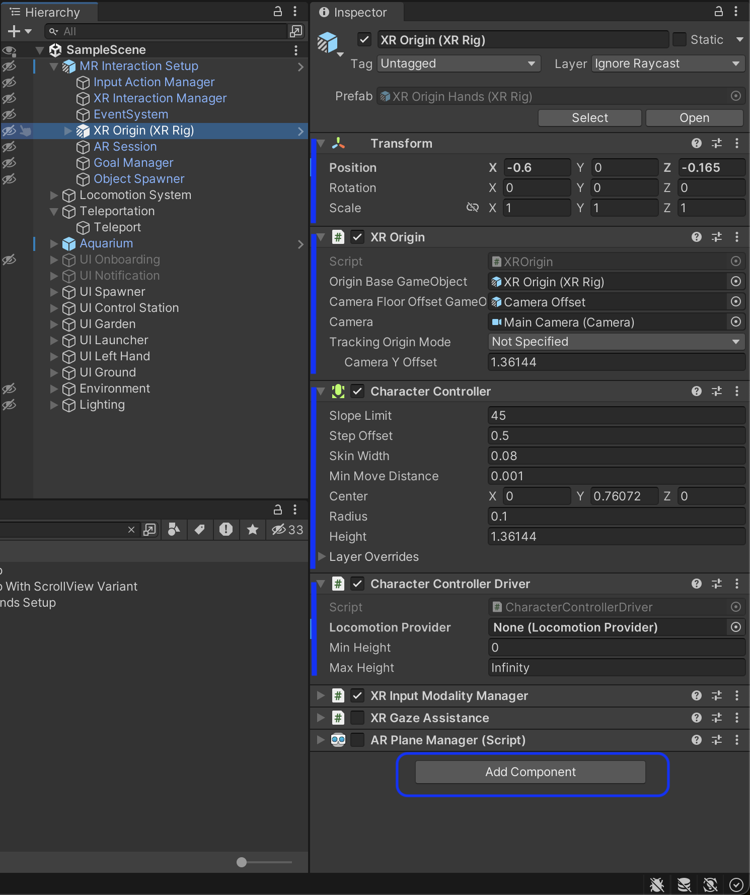

# Unity Component

Components are the building blocks of Unity. In Unity, we often say that GameObjects are “containers” of components. In other words, to create GameObjects with unique behaviors, such as the possibility to detect a surface or a plane, we add specific components to the GameObject. In the image below, a GameObject is selected in the Hierarchy Window. The inspector shows all the components attached to the GameObject. The components are stacked vertically.

— Inspector window

## Attaching components to GameObjects

As we will explore later, Unity has three ways of attaching (adding) components to GameObjects:

- Using the Inspector Window by clicking on the button “Add Component” (see X in the image)
- Using drag-and-drop, such as dragging a Unity script file and dropping it on GameObject’s Inspector window
- Or using, scripting to attach a component in a Unity script code
