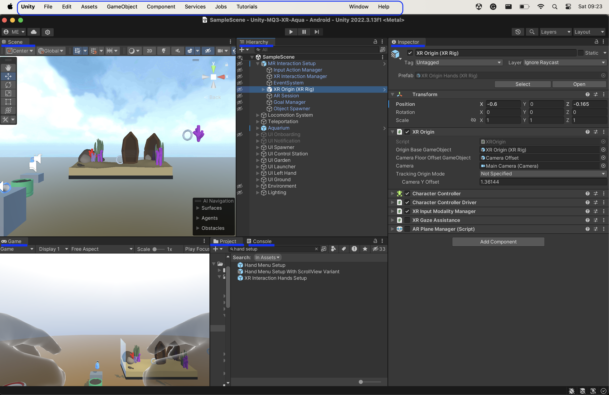
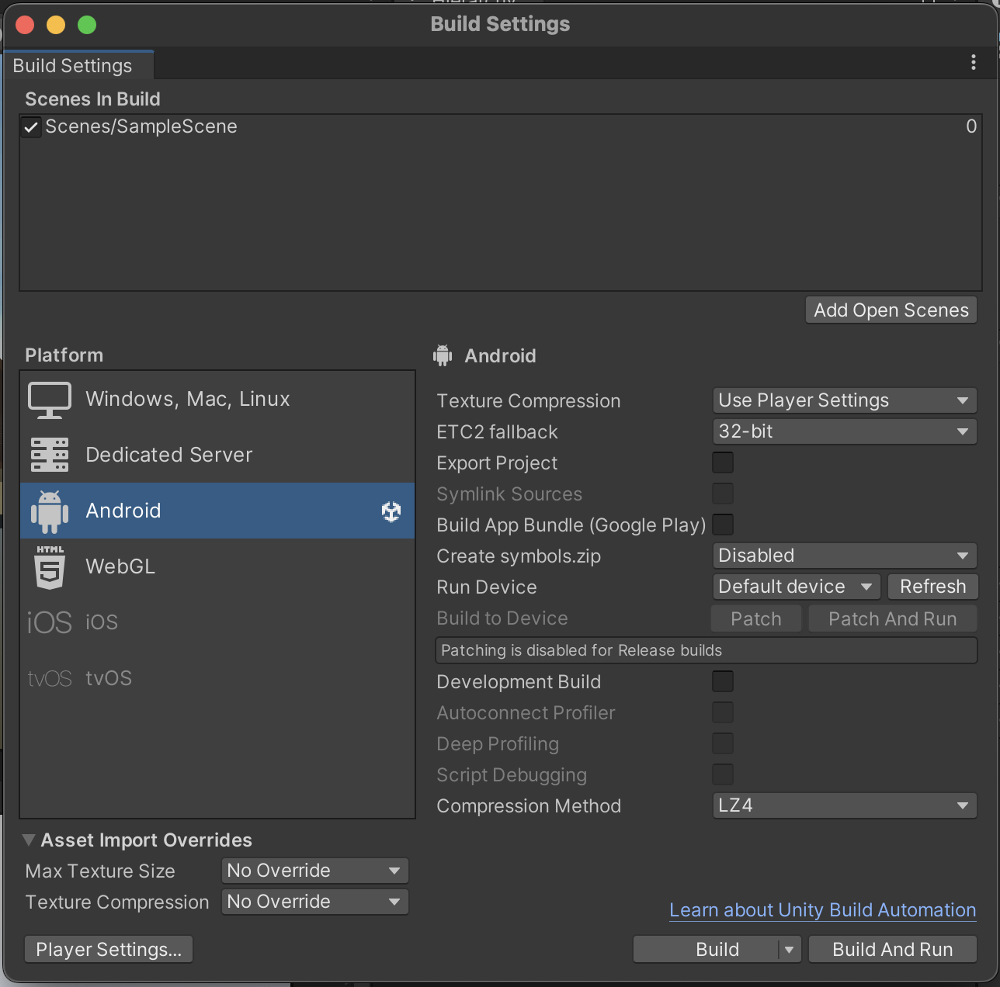
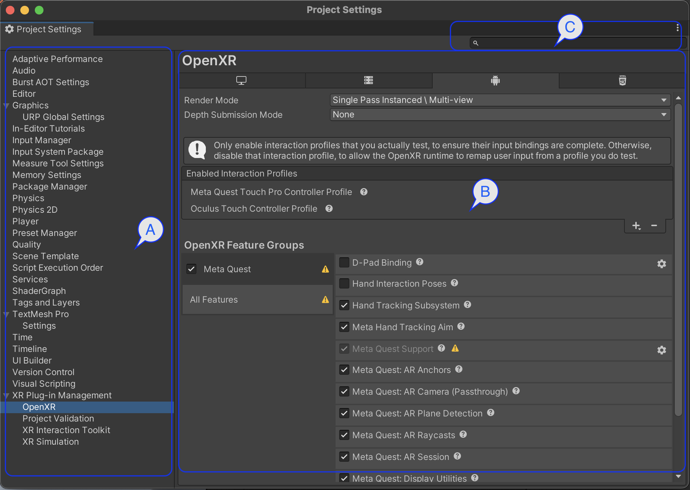
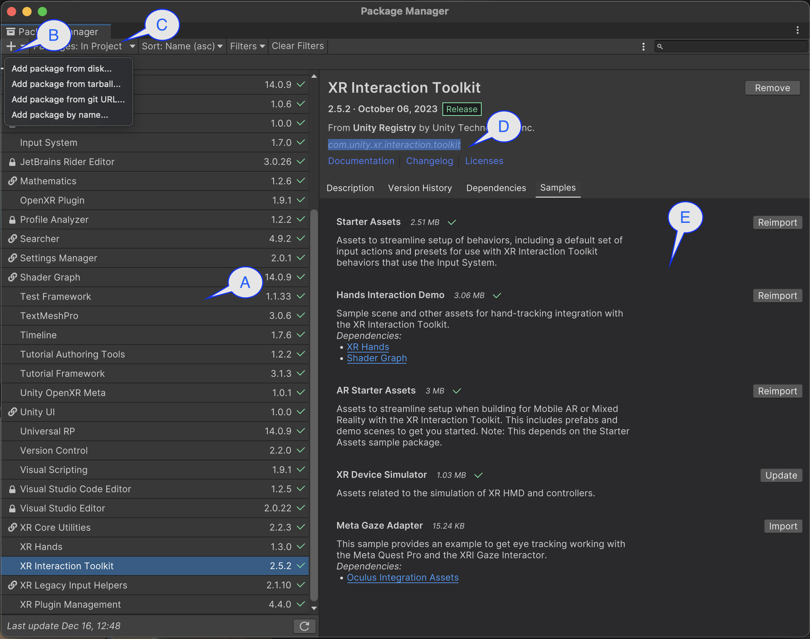

# Unity Editor

The user interface of Unity editor is composed of five main elements: **windows**, **dialog windows,** **menus**, **canvas**, and **structured editors**.

Some of the editor windows are coordinated. We often refer to this as “coordinated views.” When some windows are coordinated, and a user interacts with one window, the other windows get changed or updated depending on the the user interacts with. In Unity, the Hierarchy, Inspector, and Project windows are coordinated. For example, the Inspector, as its name suggests, enables inspecting GameObjects. When we select a GameObject the Inspector shows the components of the selected GameObject.

## Main Windows

The main windows of the editor are **Project**, **Hierarchy**, **Inspector**, **Console**, **Scene**, and **Game**. Each window enables users to perform various tasks, such as creating and manipulating GameObjects, scripts, components, and other tasks. The below image highlights the main windows. The windows are arrangeable. We can drag-and-drop windows to change the layout of the editors.

— Figure: Project Settings

## Dialog Windows

Dialog windows are secondary windows that allow the user to perform quick actions while maintaining the context of their primary task. For example, a user might be editing a GameObject for a scene, and then open a dialog window to download and install a package. Once the package is installed, the user resumes editing the GameObject. There are different dialog windows in Unity. Below, we highlight the most important ones.

## Main Menus

In addition to the windows, the Unity editor has menus. There are two types of menus: the **top menubar** and **contextual menus**. The top menubar is located on the top of Unity editor. It enables access to all functionalities of Unity.

Contextual menus are menus that we can open using a right-click on different windows. We call them contextual menus because each window offers different options in the menu. Depending on the context (meaning, the right-clicked window) the menu differs.

In particular, three menus are used quite used in the top manubar.

### Menu: File > Build Settings

This menu opens a dialog window listing different platforms for the project. The available platforms are the ones already installed using the Unity Hub. The main actions in this dialog window are:

- Add Scenes: To add/remove scenes that we want to package in the build.
- Switch Platform: To change the build for the target platform, for example from Windows to Android.
- Run Device: To select a device we want to deploy the build on, for example, a smartphone or a headset.
- Player Settings: To configure various settings of how Unity builds and renders the application.

— Figure: Build Settings

### Menu: Edit > Project Settings

The project settings diago enable us to configure various (see image below). It has three main parts:

**A.** Settings Panels: settings are organized by category, that can be selected from the panels.

**B.** Setting detail: options of a setting category.

**C.** Search field: can help find a setting option by keywords or labels. Options that correspond to a keyword are highlighted in the setting detail.

— Figure: Project Settings

### Menu: Window > Package Manager

The package manager is a dialog window that allows us to manage packages in a project, including, viewing, installing, and removing packages. Packages can be any type of assets, such as prefabs, materials, shaders, and scripts, that we can install and use in our projects.

Package Manager has different parts.

**A.** List of packages in the project

**B.** Menu for installing a package

**C.** Menu to explore and find packages

**D.** Unique name of a package. We can also install packages by their names

**E.** Some packages come with samples that we can install as well

— Figure: Package manager
