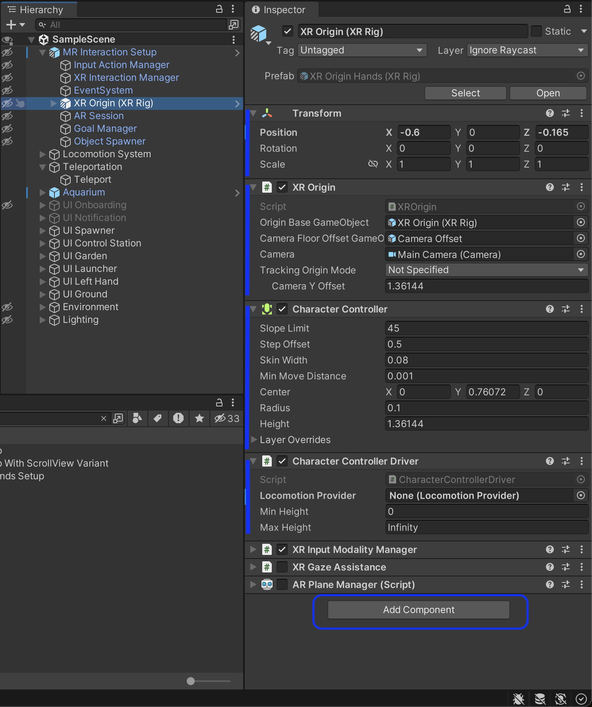

# Unity GameObject

**GameObject** represents any object that can exist in a Scene. For example, in 3D a scene, sky, terrain, and buildings, buttons, are GameObjects. Generally, everything we add to a scene in the Hierarchy window is a GameObject.

— GameObjects in the Hierarchy window

In addition, there is the GameObject class API which provides methods to work with the GameObject in Unity scripting code.

GameObject API methods include:

- Finding GameObjects
- Making connections and sending messages between GameObjects
- Adding and removing components attached to GameObjects
- Setting values to GameObjects’ status, position, rotation, scale, etc.
