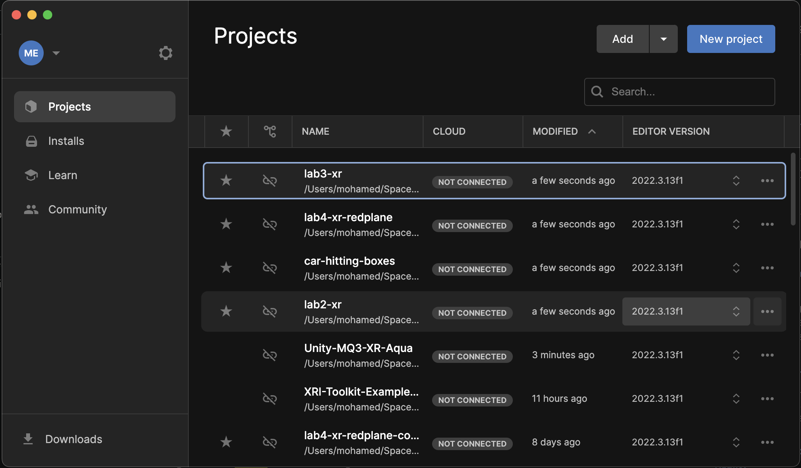
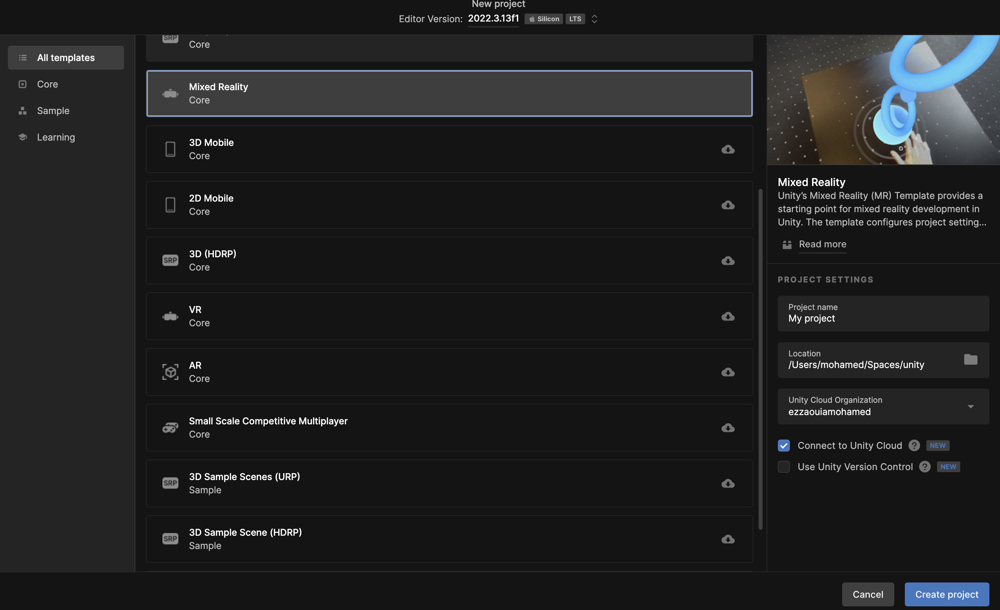

# Unity Hub

Unity Hub is a desktop application that manages module **installs** and **projects** for Unity.

The **installs** panel enables the installation of a Unity version and the modules needed, such as build modules, Android, Windows, iOS, etc.

The **projects** panel manages projects, such as adding existing or creating new projects.

— Unity Hub

Unity requires a user license. There are free plans, such as students and communities.

Unity Hub comes with different tempates for different types of projects

— Unity Hub tempaltes
