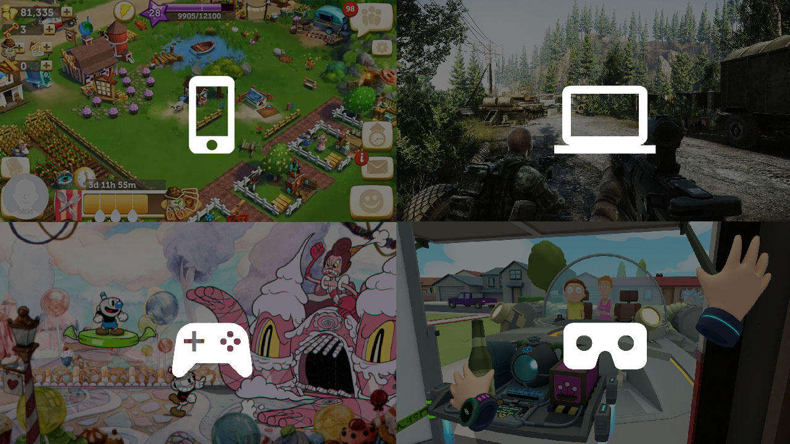
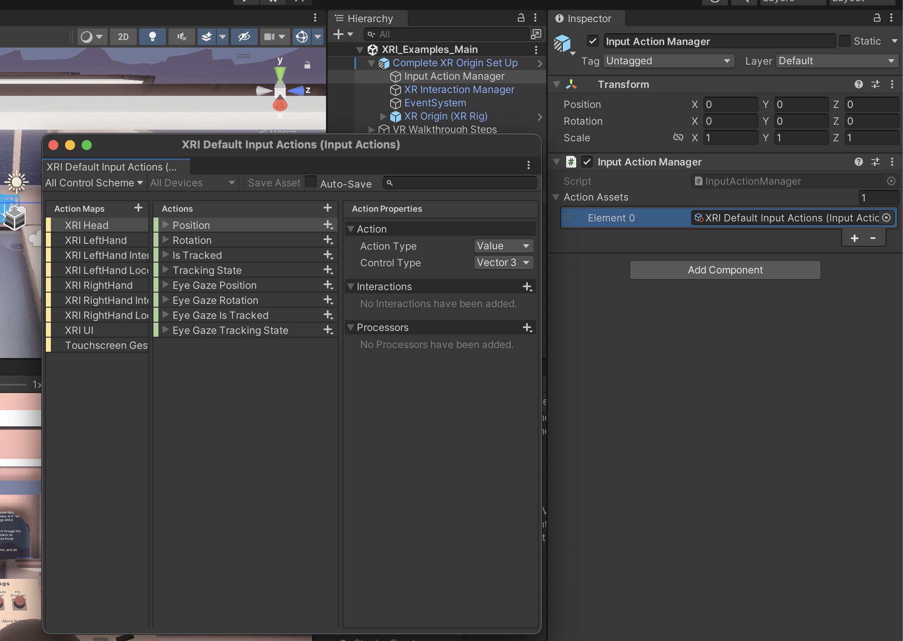

# Unity Input System

— source: [Unity Blog](https://blog.unity.com/engine-platform/introducing-the-new-input-system)

Unity Input System is a package that allows users to interact with XR applications using a

- device (such as a keyboard)
- touch screens (such as on a mobile)
- gestures (such as hand interaction on Meta Quest 3)

Input System can be configured using scripts or editor. We create actions and assign to them inputs, such as the left or right mouse button, etc.

— Input system editor

Unity supports a wide range of inputs

- Keyboards and mice
- Joysticks
- Controllers
- Touch screens
- Movement-sensing capabilities of mobile devices, such as accelerometers or gyroscopes
