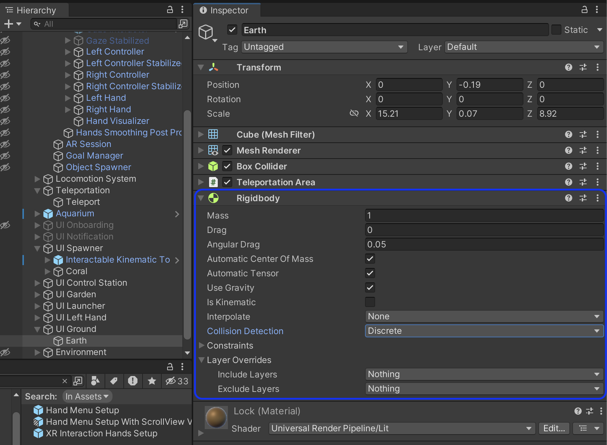

# Unity Rigidbodies

Rigidbodies are types of components in Unity. They are an essential part of the physics interactions with GameObjects. They represent the physical properties of an object, such as mass, drag, and bounciness. Without a Rigidbody, an object won't react to physics forces, such as gravity, collisions, and others.

— Rigidbody

You can learn more about Rigidbody here <https://docs.unity3d.com/Manual/class-Rigidbody.html>.
