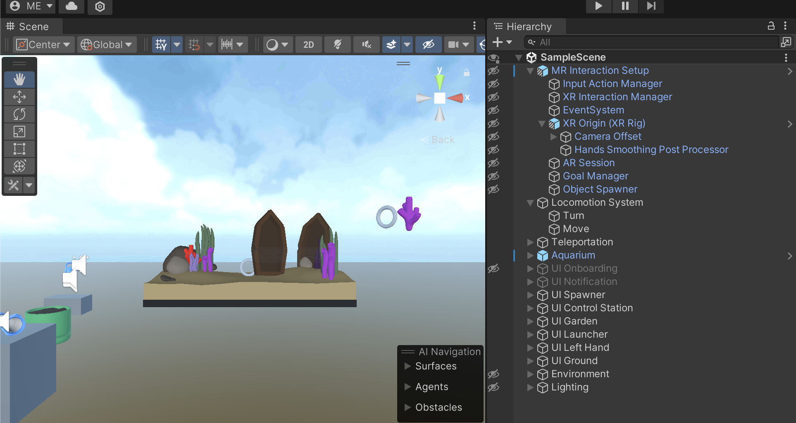

# Unity Scene

In Unity 3D applications, represents **GameObjects** in a three-dimensional space. In XR applications, the scene also includes real objects in the environment, such as floor, ceiling, wall, etc.

In Unity, a scene is an object that we create inside a project and add the Hierarchy. Scene objects have the Unity logo icon.

A scene is the main entry point of an application. When we deploy a Unity application, we deploy a scene that includes all the GameObjects of the application.

