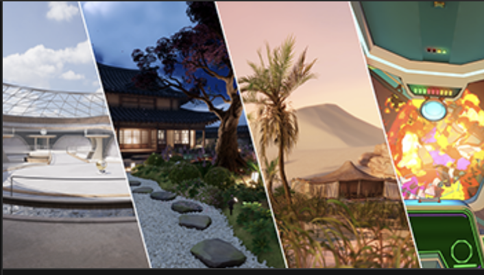

# Unity Universal Render Pipeline

— source: Unity Hub templates

In Unity, developers can customize how the graphics system renders its frames. URP is a pipeline created on the top Scriptable Render Pipelines. The Scriptable Render Pipeline (SRP) system gives developers fine-grained control over what rendering features the engine should and should not enable, which allows them to meet certain performance and visual quality for a project.
