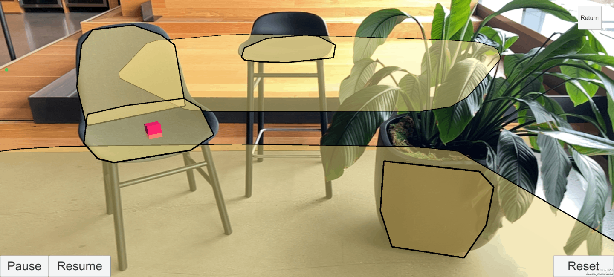

# Unity XR Trackable Managers

— source: unity.com

In AR Foundation, a "**trackable**" is anything that can be detected and tracked in the real world. Planes, point clouds, anchors, environment probes, faces, images, and 3D objects are all examples of trackable.

Each trackable has a trackable manager. All the trackable managers must be on the same `GameObject` as the AR Session Origin (XR Origin). This is because the session origin defines the transform to which all the detected trackables are relative. The trackable managers use the session origin to place the detected trackable in the correct place in the Unity scene graph.

- _Anchor_: A fixed pose (consisting of location and rotation) in the physical environment (controlled by the **AR Anchor Manager **component). This is also known as a Reference Point.

- _Reflection Probe_: Environment reflection probes for rendering shiny surface materials (controlled by the **AR Environment Probe Manager** component).

- _Face_: A human face detected by the AR device (controlled by the AR Face Manager component).

- _Human Body_: A trackable human body and the body's skeleton (controlled by the **AR Human Body Manager** component).

- _Image_: A 2D image that has been detected and tracked in the environment's **AR Tracked Image Manager** component.

- _Participant_: Another user (device) in a collaborative session.

- _Plane_: A flat plane, usually horizontally or vertically inferred from the point cloud

  (controlled by the **AR Plane Manager** component).

- _Point Cloud_: A set of depth points detected by the AR device (controlled by the **AR Point Cloud Manager** component).

- _Object_: A 3D object detected and tracked in the environment (controlled by the **AR Tracked Object Manager** component).
