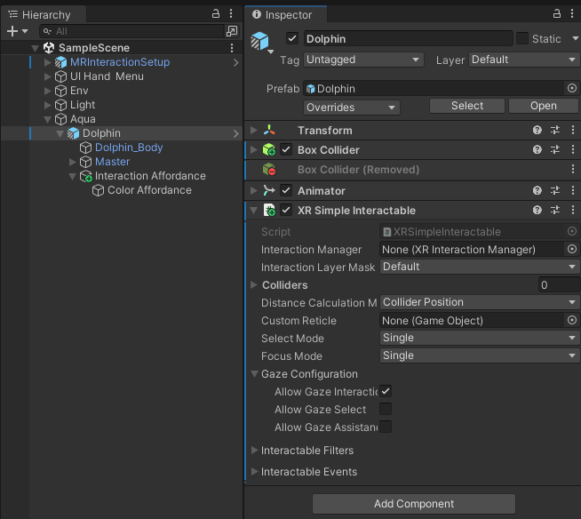
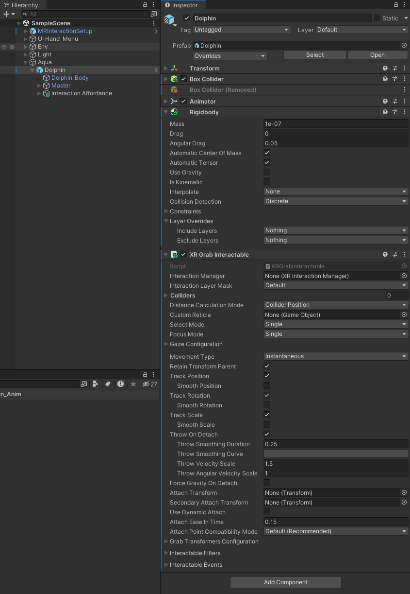

# lab - Unity XR Aquarium Interactors

The XR Unity interaction Toolkit handles user interactions. It supports both:

- Motion controllers
- Hands

These interaction states always involve three aspects:

- [Interactable](https://docs.unity3d.com/Packages/com.unity.xr.interaction.toolkit@2.5/manual/architecture.html#interactables) Providers: Objects in a scene we can hover, select, focus, and/or activate. This interaction is enabled using Interactors.
- [Interactor](https://docs.unity3d.com/Packages/com.unity.xr.interaction.toolkit@2.5/manual/architecture.html#interactors) Providers: Components that handle the actions of hovering and selecting Interactable objects in the world.
- [Affordance](https://docs.unity3d.com/Packages/com.unity.xr.interaction.toolkit@2.5/manual/affordance-system.html) Providers: Components that provide feedback to users when interacting with objects, this could be: color, audio, haptic, or transformation.

## Interaction States

| State        | Function                                                                                                                                                                                                                                                                                                                                                                                                                                                                                                                                                                       |
| ------------ | ------------------------------------------------------------------------------------------------------------------------------------------------------------------------------------------------------------------------------------------------------------------------------------------------------------------------------------------------------------------------------------------------------------------------------------------------------------------------------------------------------------------------------------------------------------------------------ |
| **Hover**    | If an Interactable is a valid target for the Interactor its state changes to Hover. Hovering on an object signifies an intention to interact with it, but doesn't typically change the behavior of that object, though it might create a visual indicator for this change of state, like how a hovered button changes tint.                                                                                                                                                                                                                                                    |
| **Select**   | Selection requires an action such as a button or trigger press from the user to enable the Select state. When an Interactable is in the Select state, Unity considers the selecting Interactor to be interacting with it. For example, Selection can simulate picking up a grabbable object, holding a lever, or preparing to push a door that has focus via hovering.                                                                                                                                                                                                         |
| **Focus**    | An Interactable is focused when it is selected. This focus persists until another Interactable is selected or the Interactable explicitly attempts to select nothing. This state is useful for performing actions on an object. For example - gaining focus of an object and then manipulating its color in a menu.                                                                                                                                                                                                                                                            |
| **Activate** | Activation is an extra action, typically mapped to a button or trigger that affects the currently selected object. This lets the user further interact with an object they've selected. The Activate action depends on the Interactable. For example, you can use Activate to toggle a grabbable flashlight on/off or shoot a ball launcher. You can hook the component to process Activate into an action without any additional code by hooking an existing callback using the Inspector window under **Interactable Events** and then add to **Activated** via UnityEvents. |

> — source: <https://docs.unity3d.com/Packages/com.unity.xr.interaction.toolkit@2.5/manual/index.html>

## Unit 1: Add a simple interaction

### XR Simlple Interactable

This is the component to handle simple interaction: hover, select, focus, and activate.

— XR Simple Interactable

1.  Inspect the from the Mini Aquarium
2.  Add XR Simlple Interactable to your Dolphin

Explore the hover, select, and grab (using grip or pinch)

## XR Grab Interactable

This is the component that handles Grab interactions using one-hand (or controller).

It also handles simple interaction, such as hover, select, focus, and activate.

It requires a RigidBody component.

— XR Grab Interactable
