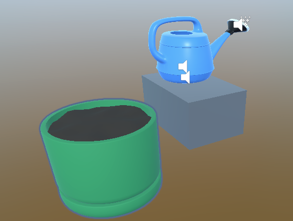

# lab - Unity XR Garden Interactors

Add a GameObject Garden to the scene.

Reset the transform of the Garden GameObject

Add a cube to the station. The cube will be the table of the Watering Can.

## Watering Can

1.  Add the prefab WateringCan.
2.  Position the WateringCan on the top of table (cube).
3.  Analayze the script **onTilt**, OnVelocity, and **RayAttachModifier** attached to the wheel Watering Can
4.  PlantGrows

## Plant

Ajouter the PlantGrows to the Garden GameObject.
