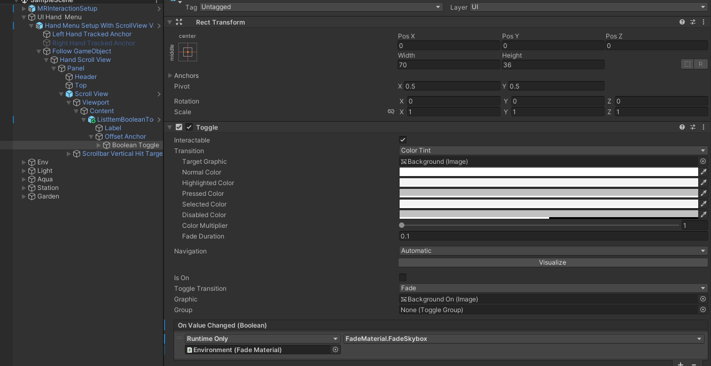
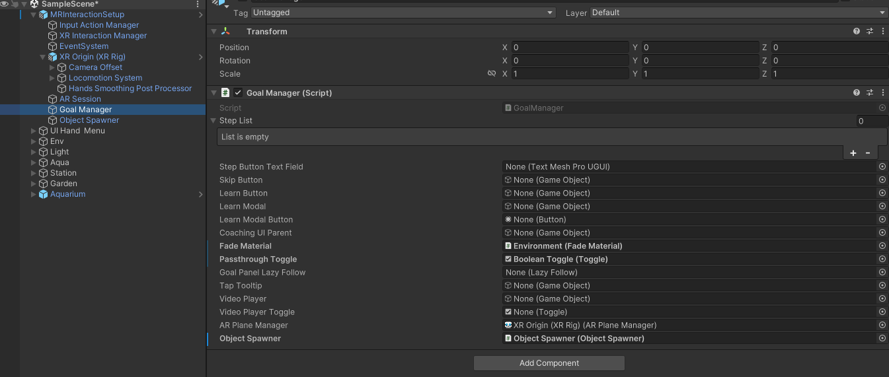

# lab - Unity XR Hand Menu

## Unit 1: Hand menu

1.  Add an empty GameObject called: **UI Hand Menu**

2.  Reset the transformation of the GameObject

3.  Search for the prefab “_Hand Menu Setup With ScrollView Variant_” and add it to the GameObject: UI Hand Menu

4.  Expand the added prefab to locate the GameObject “Content” (Follow GameObject > Hand Scroll View > Scroll View > Viewport)

5.  Search for the prefab “ListItemBooleanToggle” and add it to the “Content” GameObject

6.  Expland ListItemBooleanToggle

7.  Inspect the Label and change its Text Input to “See through”

8.  Locate Boolean Toggle and change its On Value Changed (see image below)

9.  Analyze the Prefab “Environment”, in particular, the script **FadeMaterial** 

10. Inspect the Goal Manager and update\
    \- Fade Materials\
    \- Passthrough Toggle

    

## Unit 2: Build and test

1.  Build and test the scene, you should be able to toggle between MR and VR
