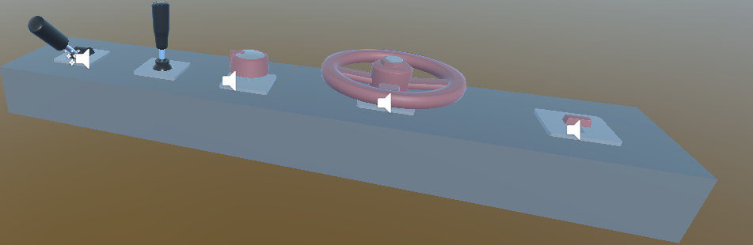

# lab - Unity XR Station Interactors

Add a GameObject Station to the scene.

Reset the transform of the Station GameObject

Add a cube to the station. The cube will be the base of the station.

## Lever

1.  Add **lever** prefab to the scene (search in assets by “level”).

2.  Make sure that the lever is well scalled and placed on the top of the base (cube).

3.  Analyze the script **XRLever**, attached to Lever, in particular, the function **onLeverActivate**.

4.  Add a Particle System, that

    1.  Releases particles when the **lever is activated**.
    2.  Stops particles when the lever is deactivated.

## Wheel

1.  Do the same to add the wheel prefab
2.  Analayze the script **XRKnob** attached to the wheel prefab
3.  in particular, the function **onValueChange**.
