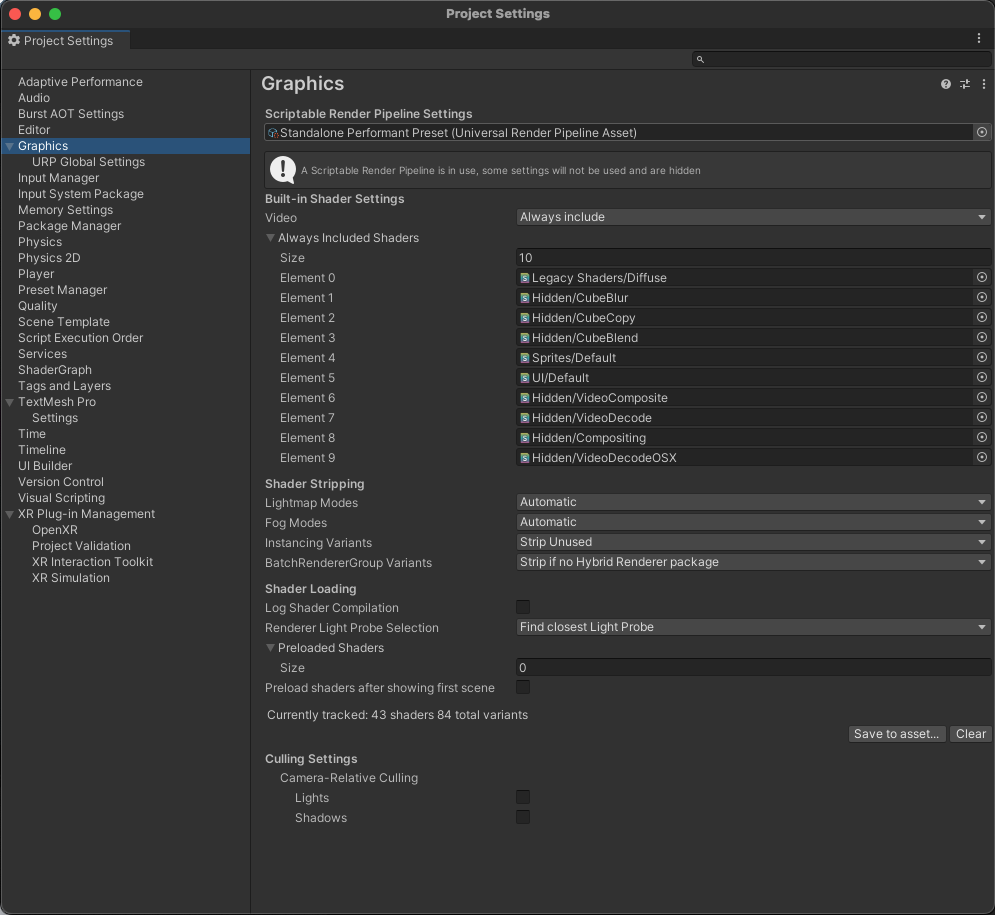
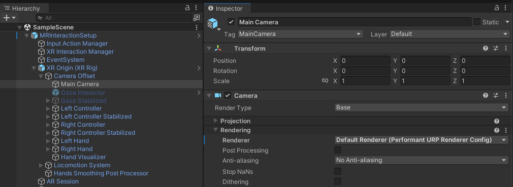

# lab 1 - Hello XR Mini Aquarium

## Unit 1: URP Project

Create a URP 3D project

Switch project to Android

(File | Build Settings)

## Unit 2: Install plugins

1.  Install: XR Plug-in Management\
    (Edit | Package Settings)

2.  Install the following plugins by name (Window | Project Manager)

    1.  com.unity.xr.interaction.toolkit
    2.  com.unity.xr.arfoundation
    3.  com.unity.xr.hands
    4.  com.unity.xr.openxr
    5.  com.unity.xr.meta-openxr
    6.  com.unity.settings-manager

## Unit 3: Assets import

Download the assets in this drive:

<https://drive.google.com/drive/folders/1lNumr2i_Ssn7bvHhSIDJeBiCu6562RIC?usp=sharing>

- MR_Setup
- XRI_Examples
- Mini_Aqua

Important the assets in your project

## Unit 4: XR setup

Create a scene: MiniAquariumScene

## Unit 5: URP setup

1.  Locate the folder “Project Configuration” inside Assets/settings

2.  Locate the file “SampleSceneProfile” inside Assets/settings

3.  Delete files inside Assets/settings **EXCEPT** for “_Project Configuration_” and “_SampleSceneProfile_”

4.  Update the Graphics (Edit | Project Settings), choose “Standalone Performant Preset”

    

5.  Search and the prefab MRInteractionSetup to the scene

6.  Inspect the Camera and change the Renderer in the Rendering, choose Default Renderer (Performant URP Renderer config)

    

## Unit 6: Add environment

1.  Add an empty GameObject called: Env
2.  Reset the the transform of the Env
3.  Search for the prefab Environment, and add it to GameObject Env

## Unit 7: Mini Aquarium setup

1.  Search and add the prefab “Aquarium” to the scene
2.  Position the Aquarium in the scene
3.  Search and add the prefab “SeaTurtle” and add it the scene
4.  Position the SeaTurtle inside the Aquarium

## Unit 8: Build and test

Build and test the project
